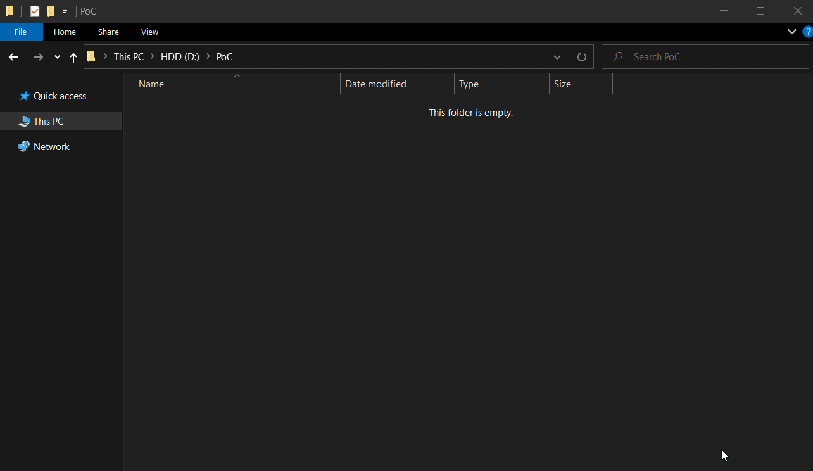

# Summary:
The context menu items "Open PowerShell window here" and "Execute with PowerShell" do not sanitize the input path. If a user open PowerShell through the context menu in a malicious folder/share, it can lead to the execution of another script / binary.

# Description:

The context menu item "Open PowerShell window here" and "Execute with PowerShell" does not sanitize the input path.  
If a user open PowerShell through the context menu in a malicious folder/share, it can lead to the execution of another script / binary.  
PowerShell will append the folder name to the command line. PowerShell will try to execute the folder name.

# Impact:
An attacker could create a malicious file and a malicious folder. If a user try to execute the script inside the folder, it will execute the malicious file instead.

# Demo:
## Dumb version: 

## Pentest version:

# Steps to Reproduce:

## Command injection in the filename:
1. Create a share/folder with the following name : MyFolder **'$(calc.exe)'**
2. Explore this share/folder with the explorer (double click on the folder).
3. Create a powershell file (New File > myscript.ps1).
4. Use the context menu, "Run with Powershell".
5. Powershell fails to execute the script. It leads to the execution of the payload (calc.exe in this case).

## Execution of a local file:
1. Create a share/folder with the following name : **build**'#Master
2. Explore this share/folder with the explorer (double click on the folder).
3. Create a powershell file (New File > myscript.ps1).
4. Use the context menu, "Run with Powershell".
5. Powershell fails to execute the script.
6. Windows tries to resolve the file "build", it runs "build.cmd".

# Intended behavior:
The Powershell should sanitize the path and execute the script.

# Microsoft Security Response Center Response:
Microsoft has decided that it will not be fixing this vulnerability in the current version and we are closing this case.  In this case this is due to the heavy target interaction required.

# Windows Version:
    Edition    Windows 10 Pro N
    Version    20H2
    OS build    19042.844
    Experience    Windows Feature Experience Pack 120.2212.551.0

# Supporting materials/ references:
ExecuteWithPowershell.gif (Dumb PoC) 
LocalFile.gif (Better PoC) 
OpenPowerShellWindow.gif (PoC for "Open PowerShell Window here")
